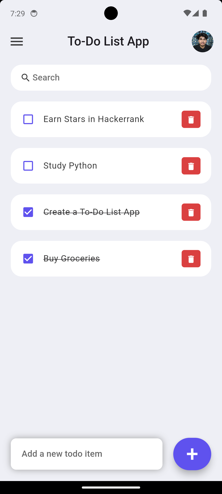
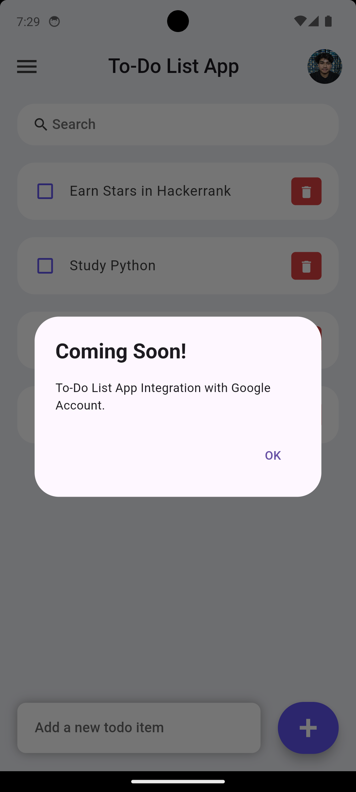

# Flutter To-Do List App

A simple and user-friendly To-Do List application built with Flutter. This app allows users to add, delete, and search for tasks, with persistent storage to save tasks even after closing the app.

## Features

- **Add To-Do Items**: Easily add new tasks to your to-do list.
- **Delete To-Do Items**: Remove tasks that are completed or no longer needed.
- **Search**: Quickly find tasks using the search bar.
- **Persistent Storage**: Tasks are saved locally on your device and will be available even after the app is closed and reopened.
- **User-Friendly Interface**: Simple and clean design for an enhanced user experience.
- **Coming Soon**: Integration with Google.

## Screenshots

<p align="center">
  
  
</p>

## Getting Started

To get a local copy up and running follow these simple steps.

### Prerequisites

- Flutter SDK: [Install Flutter](https://flutter.dev/docs/get-started/install)
- A code editor (VS Code, IntelliJ, Android Studio, etc.)

### Installation

1. Clone the repository
   ```sh
   git clone https://github.com/th3varun/to_do_list_app.git
2. Navigate to the project directory
   ```sh
   cd to_do_list_app
3. Install dependencies
   ```sh
   flutter pub get
4. Run the app
   ```sh
   flutter run

## Usage

- **Add a new task**: ype your task in the input field at the bottom and press the '+' button.
- **Delete a task**: Press the delete icon next to the task you want to remove.
- **Search for a task**: Type in the search bar to filter tasks by their name.
- **Mark a task as done/undone**: Tap on the task to toggle its completion status.
- **Profile Image**: ap on the profile image to see the message "Integration with Google soon".

## Contributing

Contributions are what make the open source community such an amazing place to learn, inspire, and create. Any contributions you make are greatly appreciated.

- Fork the Project.
- Create your Feature Branch (`git checkout -b feature/AmazingFeature`).
- Commit your Changes (`git commit -m 'Add some AmazingFeature'`).
- Push to the Branch (`git push origin feature/AmazingFeature`)
- Open a Pull Request

## License

Distributed under the MIT License. See `LICENSE` for more information.

## Contact

Varun Gohe - thevarungohe@gmail.com
Project Link: https://github.com/th3varun/to_do_list_app

